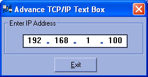



## Advance TCP/IP Text Box

### Description

A textbox for TCP/IP or DNS entry with validation and formatting. It behaves like Windows TCP/IP entry. Very nice in developing program that requires valid IP entry.
 
### More Info
 
TCP/IP, DNS, etc.

correct IP format

             |
---                |---
**Submitted On**   |2002-02-14 23:28:24
**By**             |[Francis M\.  Marasigan](https://github.com/Planet-Source-Code/PSCIndex/blob/master/ByAuthor/francis-m-marasigan.md)
**Level**          |Intermediate
**User Rating**    |4.9 (59 globes from 12 users)
**Compatibility**  |VB 6\.0
**Category**       |[String Manipulation](https://github.com/Planet-Source-Code/PSCIndex/blob/master/ByCategory/string-manipulation__1-5.md)
**World**          |[Visual Basic](https://github.com/Planet-Source-Code/PSCIndex/blob/master/ByWorld/visual-basic.md)
**Archive File**   |[Advance\_TC552572142002\.zip](https://github.com/Planet-Source-Code/francis-m-marasigan-advance-tcp-ip-text-box__1-31794/archive/master.zip)

